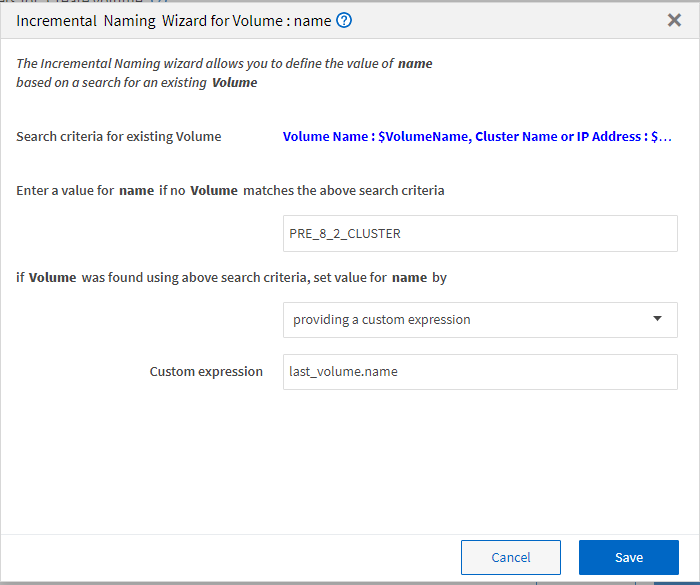

= 증분 이름은 입니다
:allow-uri-read: 
:icons: font
:imagesdir: ../media/

[role="lead"]
증분 이름 지정은 매개 변수의 검색 결과에 따라 워크플로의 속성 이름을 지정할 수 있는 알고리즘입니다. 증분 값이나 사용자 정의 식을 기반으로 특성의 이름을 지정할 수 있습니다. 증분 명명 기능을 사용하면 요구 사항에 따라 명명 규칙을 구현할 수 있습니다.

워크플로우를 설계할 때 증분 명명 기능을 사용하여 워크플로우에서 생성한 객체의 이름을 동적으로 지정할 수 있습니다. 이 기능을 사용하면 리소스 선택 기능을 사용하여 개체에 대한 검색 기준을 지정할 수 있으며 검색 조건에 의해 반환되는 값은 개체의 특성에 사용됩니다. 또한 지정된 검색 조건으로 개체를 찾을 수 없는 경우 속성 값을 지정할 수 있습니다.

다음 옵션 중 하나를 사용하여 속성의 이름을 지정할 수 있습니다.

* 증분 값과 접미사를 제공합니다
+
검색 조건에 의해 찾은 개체 값과 함께 사용해야 하는 값을 제공하고 지정한 수로 증분할 수 있습니다. 예를 들어, 이름이 '_filer name_unique number_environment_'인 볼륨을 생성하려면 finder를 사용하여 이름 접두사로 마지막 볼륨을 찾고 고유 번호를 1로 증가시키면서 볼륨 이름에 접미사 이름을 추가할 수 있습니다. 검색된 마지막 볼륨 이름 접두사가 _VF_023_prod_이고 세 개의 볼륨을 생성하는 경우 생성된 볼륨의 이름은 _VF_024_prod, VF_025_prod, _ 및 _VF_026_prod._입니다

* 사용자 정의 식 제공
+
검색 조건에 의해 찾은 개체 값과 함께 사용해야 하는 값을 제공하고 입력한 식에 따라 값을 추가할 수 있습니다. 예를 들어 "Last volume name_environment name padded with 1"이라는 명명 규칙을 사용하여 볼륨을 생성하려면 "last_volume.name+'_'+nextName("lab1")" 식을 입력할 수 있습니다. 발견된 마지막 볼륨 이름이 _VF_023 인 경우 _ 생성된 볼륨의 이름은 _VF_023_lab2._입니다

다음 그림에서는 명명 규칙을 지정하기 위해 사용자 정의 식을 제공하는 방법을 보여 줍니다.

