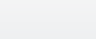

= 모니터링 창
:allow-uri-read: 
:icons: font
:imagesdir: ../media/

[role="lead"]
모니터링 창에는 워크플로의 계획 또는 실행 단계 결과에 대한 세부 정보가 표시됩니다. 창의 탭에는 읽기 전용 콘텐츠가 표시됩니다. Details *, * Preview * 또는 * Execute * 옵션을 선택하면 WFA 애플리케이션의 다양한 영역에서 이 창에 액세스할 수 있습니다.

* 상태 영역
* 유동 탭
* 세부 정보 탭
* 실행 계획 탭
* 사용자 입력
* Return Parameters(매개 변수 반환) 탭
* 기록 탭

== 상태 영역

탭 위의 상태 영역에는 계획 또는 실행 프로세스의 결과에 대한 자세한 정보가 표시됩니다.

* * 워크플로 상태 *
+
창 맨 위에 색으로 구분된 머리글이 계획 또는 실행 프로세스의 결과를 표시합니다.

+
** 녹색은 계획 완료 또는 실행 완료와 같은 성공적인 작업을 나타냅니다.
** 빨간색은 실패를 나타냅니다 -- 예를 들어, 계획 실패 또는 실행 실패를 나타냅니다.

* * 정보 작업 감소/증가 *
+
이 작업 링크는 미리 보기 또는 실행 프로세스가 실패할 때 사용할 수 있습니다. 작업 링크를 사용하여 * Less info * 와 * More info * 간에 전환할 수 있습니다. 작업에 따라 실패한 결과에 대한 정보를 더 많이 표시하거나 더 적게 표시하기 위해 링크가 정보 상자를 열거나 닫습니다.

* * 상세 상태 *
+
이 상자는 미리 보기 또는 실행 프로세스가 실패할 때 사용할 수 있습니다. 계획 또는 실행 프로세스에 대한 세부 정보를 표시합니다. 프로세스가 실패하면 이 상자는 기본적으로 열리며 오류 원인에 대한 세부 정보를 제공합니다.

== 유동 탭

Flow(흐름) 탭은 워크플로의 그래픽 표시를 제공합니다.

명령 및 하위 워크플로는 아래 표시된 개체 및 변수와 함께 맨 위 행에 표시됩니다. 미리 보기 또는 실행 중 명령 세부 정보 및 하위 워크플로의 상태는 다양한 색으로 표시됩니다.

다음 표는 다음과 같습니다.

* 명령 또는 워크플로 실행 상태를 표시하는 데 사용되는 색 구성표입니다
* 창에 사용되는 아이콘입니다

[cols="25h,~"]
|===
| 색상 개요 및 아이콘 | 상태 

 a| 

 a| 
성공적으로 실행하였습니다

 a| 
image:../media/execution_failed.gif["빨간색 상자"]
 a| 
실행에 실패했습니다

 a| 

 a| 
실행이 진행 중입니다

 a| 

 a| 
실행을 건너뛰었습니다

 a| 

 a| 
하위 워크플로 헤더

 a| 
image:../media/info_icon_execute_wfa.gif[""]
 a| 
로그를 엽니다

 a| 

 a| 
하위 워크플로에는 승인 지점이 포함됩니다

|===

== 세부 정보 탭

세부 정보 탭은 워크플로에 대한 자세한 정보를 제공합니다. 이 정보는 표 형식으로 제공되며 머리글 행의 명령과 아래 나열된 관련 개체 및 변수가 함께 제공됩니다. 이 탭은 각 명령에 모든 인수 및 매개 변수를 제공합니다.

이 탭은 실패한 워크플로의 미리 보기 또는 실행을 디버깅하는 데 유용합니다.

== 실행 계획 탭

실행 계획 탭은 실행 중인 워크플로 명령 및 해당 인수(스크립트 또는 명령)의 번역된 목록을 제공합니다.

이 탭을 사용하여 실패한 워크플로의 미리 보기 또는 실행을 디버깅할 수 있습니다.

== 사용자 입력 탭

사용자 입력 탭은 워크플로의 미리 보기 또는 실행 중에 사용자가 입력한 값을 표시합니다.

정렬 화살표(image:../media/wfa_sortarrow_down_icon.gif["정렬 아이콘"] 또는 image:../media/wfa_sortarrow_up_icon.gif["정렬 아이콘"])를 클릭하여 열 항목을 오름차순 또는 내림차순으로 정렬합니다.

== Return Parameters(매개 변수 반환) 탭

반환 매개 변수 탭에는 매개 변수 이름 및 매개 변수 값을 기준으로 워크플로의 출력이 나열됩니다.

웹 서비스를 사용하여 이러한 반환 매개 변수에 액세스할 수 있습니다.

== 기록 탭

기록 탭에는 워크플로의 상태 변경, 상태 변경이 발생한 시기, 작업을 시작한 사람 및 상태 변경과 관련된 메시지가 나열됩니다.

== 명령 버튼

* * 로그 다운로드 *
+
특정 실행 로그를 포함하여 모든 로그 파일의 'zip' 파일을 다운로드할 수 있습니다.

* * 열 가시성 *
+
세부 정보 탭에서 열을 표시하거나 숨길 수 있습니다.

* * OK *(확인 *)
+
모니터링 창을 닫습니다.

