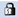

= 구성표 창
:allow-uri-read: 
:icons: font
:imagesdir: ../media/

[role="lead"]
구성표 창에는 사용 가능한 구성표가 표시되고 구성표 관리를 수행할 수 있습니다. OnCommand Workflow Automation(WFA)은 환경에 관련된 데이터를 가져오기 위해 구성표를 사용합니다.

스키마는 시스템의 데이터 모델을 나타냅니다. 데이터 모델은 사전 항목의 모음입니다. 스키마를 정의한 다음 데이터 소스 형식을 정의할 수 있습니다. 데이터 원본은 데이터 획득 방법과 스키마가 채워지는 방법을 정의합니다. 예를 들어, _VC scheme_에는 가상 머신, 호스트 및 데이터 저장소와 같은 가상 환경과 관련된 데이터가 포함되어 있습니다.

== 구성표 표

구성표 표에는 사용 가능한 구성표 항목이 나열됩니다. 각 항목은 다음 중 하나로 식별됩니다.

* image:../media/community_certification.gif[""] - 사용자가 만든 콘텐츠입니다
* image:../media/ps_certified_icon_wfa.gif[""] ?PS(Professional Services)에서 개발한 컨텐츠로, PS에서 설치한 사용자 정의 설치에서만 사용할 수 있습니다
* image:../media/community_certification.gif[""] 사용자가 개발한 팩입니다
*  - 잠긴 사용자가 만든 콘텐츠입니다
* image:../media/netapp_certified.gif[""] 인증받은 NetApp 컨텐츠

각 열에 사용할 수 있는 필터링 및 정렬 기능을 사용하거나 열 순서를 다시 정렬하여 표 표시를 사용자 지정할 수 있습니다.

* image:../media/filter_icon_wfa.gif["필터 아이콘"] 전체 테이블에 대한 필터링을 설정하거나 해제합니다. 필터링이 비활성화된 경우 아이콘 위에 빨간색 "x"가 나타납니다.
* 두 번 클릭합니다 image:../media/filter_icon_wfa.gif["필터 아이콘"] 필터링 선택을 지우고 재설정합니다.
* image:../media/wfa_filter_icon.gif["필터 아이콘"] 각 열 머리글에서 열의 내용을 기준으로 필터링할 수 있습니다. 를 클릭합니다 image:../media/wfa_filter_icon.gif["필터 아이콘"] 열에서 드롭다운 목록 또는 사용 가능한 모든 항목의 특정 항목을 필터링할 수 있습니다.
* 열 머리글을 클릭하면 정렬 순서가 오름차순과 내림차순으로 전환됩니다. 적용된 정렬 순서를 정렬 화살표(image:../media/wfa_sortarrow_up_icon.gif["정렬 아이콘"] 오름차순 및 의 경우 image:../media/wfa_sortarrow_down_icon.gif["정렬 아이콘"] 내림차순).
* 열의 위치를 다시 정렬하려면 열을 끌어서 놓아 원하는 순서대로 배치할 수 있습니다. 그러나 이러한 열은 숨기거나 삭제할 수 없습니다.
* 검색 * 필터 텍스트 상자를 클릭하면 특정 콘텐츠를 검색할 수 있습니다. 또한 지원되는 연산자를 사용하여 해당 열 유형, 알파벳 또는 숫자를 검색할 수 있습니다.

구성표 테이블에는 다음과 같은 열이 있습니다.

* * 인증 *
+
구성표가 사용자 생성(image:../media/community_certification.gif[""]), PS(image:../media/ps_certified_icon_wfa.gif[""]), 커뮤니티(image:../media/community_certification.gif[""]), 사용자 잠금() 또는 NetApp 인증(image:../media/netapp_certified.gif[""])를 클릭합니다.

* * 이름 *
+
구성표 이름을 표시합니다.

+
검색 * 필터 텍스트 상자에 이름을 입력하여 스키마를 검색할 수 있습니다.

* * 표시 이름 *
+
구성표 이름을 표시합니다.

+
검색 * 필터 텍스트 상자에 이름을 입력하여 스키마를 검색할 수 있습니다.

* * 엔터티 버전 *
+
오브젝트의 버전 번호를 major.minor.revision 형식(예: 1.0.0)으로 표시합니다.

+
검색 * 필터 텍스트 상자에 버전 번호를 입력하여 구성표를 검색할 수 있습니다.

* * 설명 *
+
구성표에 대한 설명을 표시합니다.

+
검색 * 필터 텍스트 상자에 설명을 입력하여 스키마를 검색할 수 있습니다.

* * 유형 *
+
스키마를 사용하여 원격 시스템에서 데이터를 가져오는지, 아니면 워크플로나 명령에서 직접 데이터를 가져오는지 여부를 나타냅니다. 가능한 값은 데이터 소스 획득 및 기타 값입니다.

+
검색 * 필터 텍스트 상자에 유형을 입력하여 스키마를 검색할 수 있습니다.

* * 플래그 재설정 *
+
다음 데이터 획득 주기 동안 스키마가 재설정되는지 여부를 나타냅니다. 가능한 값은 TRUE 및 FALSE입니다.

* * 마지막 업데이트 날짜: *
+
구성표가 마지막으로 업데이트된 날짜와 시간을 표시합니다.

+
필터 드롭다운 목록에서 필요한 시간 범주를 선택하여 구성표를 검색할 수 있습니다.

* * 업데이트: *
+
구성표를 업데이트한 사용자의 이름을 표시합니다.

+
검색 * 필터 텍스트 상자에 사용자 이름을 입력하여 스키마를 검색할 수 있습니다.

* * 잠금 기준 *
+
구성표를 잠근 사용자의 이름을 표시합니다.

+
검색 * 필터 텍스트 상자에 사용자 이름을 입력하여 스키마를 검색할 수 있습니다.

== 도구 모음

도구 모음은 열 머리글 위에 있습니다. 도구 모음의 아이콘을 사용하여 다양한 작업을 수행할 수 있습니다. 이러한 작업은 창의 오른쪽 클릭 메뉴에서도 액세스할 수 있습니다.

* *image:../media/new_wfa_icon.gif["새 아이콘"] (신규) *
+
새 구성표 대화 상자를 엽니다. 이 대화 상자에서 새 구성표를 만들 수 있습니다.

* *image:../media/edit_wfa_icon.gif["편집 아이콘"] (편집) *
+
선택한 구성표에 대한 구성표 <schemeName> 대화 상자를 엽니다. 이 대화 상자에서 구성표를 편집할 수 있습니다.

* *image:../media/lock_wfa_icon.gif["잠금 아이콘"] (잠금) *
+
선택한 구성표를 잠글 수 있는 구성표 잠금 확인 대화 상자를 엽니다. 이 옵션은 사용자가 만든 구성표에 대해서만 사용할 수 있습니다.

* *image:../media/unlock_wfa_icon.gif["잠금 해제 아이콘"] (잠금 해제) *
+
선택한 구성표의 잠금을 해제할 수 있는 구성표 잠금 해제 확인 대화 상자를 엽니다. 이 옵션은 잠근 구성표에 대해서만 활성화됩니다. 관리자는 다른 사용자가 잠근 구성표 잠금을 해제할 수 있습니다.

* *image:../media/delete_wfa_icon.gif["삭제 아이콘"] (삭제) *
+
선택한 사용자 작성 구성표를 삭제할 수 있는 구조 삭제 확인 대화 상자를 엽니다.

+

NOTE: WFA 또는 PS 구성표는 삭제할 수 없습니다.

* * (내보내기) *
+
선택한 사용자 작성 구성표를 내보낼 수 있습니다.

+

NOTE: WFA 또는 PS 구성표는 내보낼 수 없습니다.

* *image:../media/reset_scheme_wfa_icon.gif["구성표 재설정 아이콘"] (구조 재설정) *
+
다음 데이터 획득 주기 동안 구성표를 재설정할 수 있습니다.

* *image:../media/add_to_pack.png["팩 아이콘에 추가"] (팩에 추가) *
+
구성표와 신뢰할 수 있는 요소를 팩에 추가할 수 있는 팩 구성표에 추가 대화 상자를 엽니다. 이 대화 상자는 편집할 수 있습니다.

+

NOTE: 팩에 추가 기능은 인증이 * 없음 * 으로 설정된 구성표에 대해서만 활성화됩니다

* *image:../media/remove_from_pack.png["팩에서 제거 아이콘"] (팩에서 제거) *
+
선택한 구성표에 대한 패키지 구성표에서 제거 대화 상자를 엽니다. 이 대화 상자에서 구성표를 삭제하거나 팩에서 제거할 수 있습니다.

+

NOTE: 인증에서 제거 기능은 인증이 * 없음 * 으로 설정된 구성표에 대해서만 활성화됩니다

