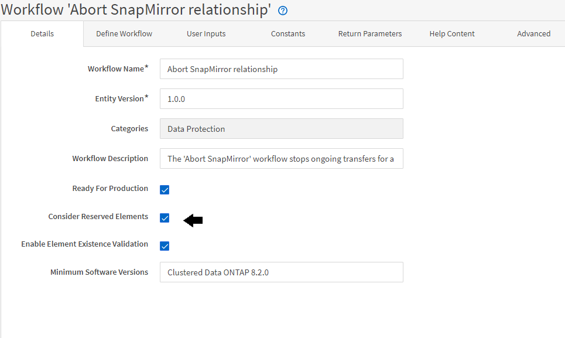

= 예약 방식
:allow-uri-read: 
:icons: font
:imagesdir: ../media/

[role="lead"]
OnCommand Workflow Automation 리소스 예약 기능은 워크플로우를 성공적으로 실행하기 위해 리소스를 사용할 수 있도록 필요한 리소스를 예약합니다.

WFA 명령은 필요한 리소스를 예약하고 대개 캐시 획득 후 리소스가 WFA 캐시 데이터베이스에서 제공된 후에 예약을 제거할 수 있습니다. 예약 기능을 사용하면 WFA 구성 설정에서 구성한 예약 만료 기간 전까지 워크플로우에 대해 예약 리소스를 사용할 수 있습니다.

예약 기능을 사용하면 리소스를 선택하는 동안 다른 워크플로에서 예약한 리소스를 제외할 수 있습니다. 예를 들어 aggregate에서 100GB의 공간을 예약된 워크플로가 1주일 후에 실행되도록 예약된 경우, 또한 * 볼륨 생성 * 명령을 사용하는 다른 워크플로우를 실행 중입니다. 실행 중인 워크플로우에서 예약된 공간을 사용하여 새 볼륨을 생성하지 않습니다. 또한 예약 기능을 통해 워크플로우를 병렬로 실행할 수 있습니다.

실행 워크플로우를 미리 볼 때 WFA 플래너는 캐시 데이터베이스의 기존 개체를 비롯하여 예약된 모든 개체를 고려합니다. 예약을 사용하도록 설정한 경우, 계획된 워크플로우와 동시에 실행되는 워크플로우의 효과 및 스토리지 요소를 계획에 고려해야 합니다.

다음 그림의 화살표는 워크플로에 대해 예약이 활성화되어 있음을 나타냅니다.

== 사전 정의된 워크플로의 예약 예

Designer에서 다음과 같은 미리 정의된 워크플로를 열어 예약 사용 방법을 파악할 수 있습니다.

* 클론 환경
* Clustered Data ONTAP 볼륨을 생성합니다
* 클러스터 피어링을 설정합니다
* Clustered Data ONTAP 볼륨을 제거합니다

